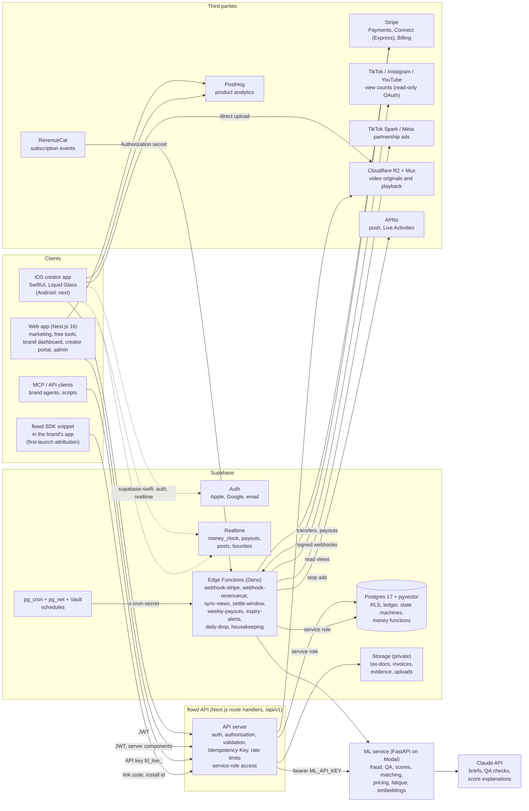
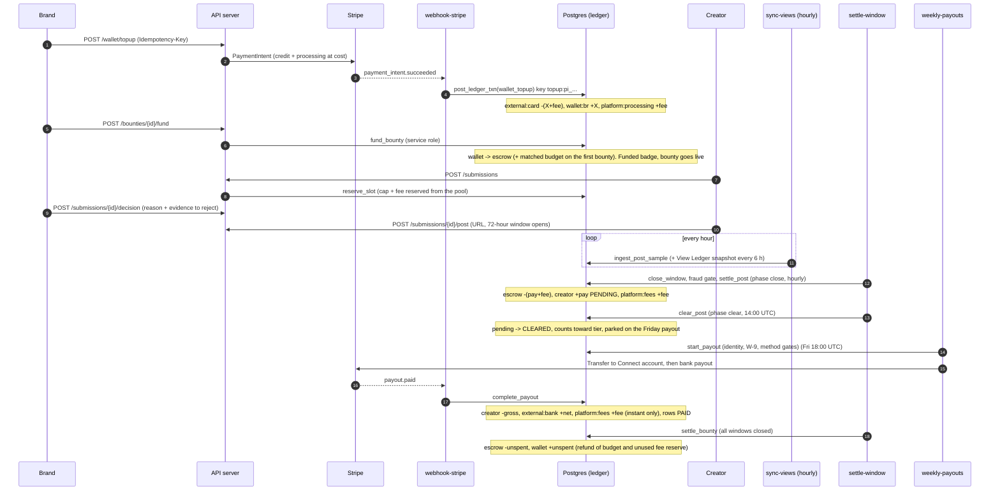
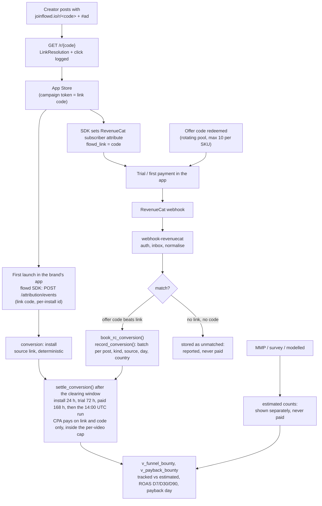

# flowd architecture

How flowd is built, how money and attribution flow through it, where the trust boundaries are, and exactly what is mocked in this repository versus real in production.

> Companion documents: [`packages/contract/DOMAIN.md`](../packages/contract/DOMAIN.md) (entities, enums, state machines, formulas, and the product constants: fee ladder, CPM floor, windows, tiers), [`packages/contract/openapi.yaml`](../packages/contract/openapi.yaml) (the API), [`supabase/README.md`](../supabase/README.md) (running the backend), [`supabase/SCHEMA.md`](../supabase/SCHEMA.md) (every table and column).

## 1. Principles

1. **The database is the source of truth and the last line of defence.** Money rules (double entry, escrow identity, balance floors, state machines, append-only history, "no perpetual rights") are enforced by constraints, triggers and `SECURITY DEFINER` functions, not by application code that a bug could skip. A bug in a function fails the transaction at COMMIT instead of corrupting money.
2. **Integer cents, one ledger.** Every amount is an integer number of cents. Every movement of money is a balanced set of legs in one append-only ledger. Wallet balances, escrow columns and earning states are projections of it and are re-checked against it.
3. **Idempotent everywhere.** Every settlement step, webhook and scheduled job can run twice and do the work once (ledger idempotency keys, the webhook inbox, job slots, Idempotency-Key on the API).
4. **Keep the business logic on the server, ship iOS first.** Native clients render and capture; pricing, scoring, settlement and permissions are server-side (and mirrored in the TypeScript and Swift engines only for instant previews, with parity tests against shared vectors).
5. **Adapters at every third-party edge.** TikTok, Instagram, YouTube, Stripe, RevenueCat, ad platforms, APNs and the ML service sit behind interfaces with a deterministic mock and a live implementation. A mock deployment cannot reach a real provider by accident.
6. **Honesty is a feature.** Checklist scores are labelled as checklists; estimates are labelled estimates; a number never appears without its state (pending, cleared, paid), its date and its reason.

## 2. System

**Trust boundaries** are the edges that cross a box border: the public internet into the API (JWT or API key, rate limits, validation), the API and the edge functions into Postgres (the **service role**, which bypasses RLS and is the only role that can call the money functions), provider webhooks into the edge functions (the *provider* is authenticated: Stripe signature, RevenueCat secret), and the ML service (bearer key, no database access). Clients never hold the service role; they hold a user JWT and are constrained by RLS and column grants.

### Components

| Component | Where | Responsibility |
|---|---|---|
| Postgres | `supabase/migrations` | Schema, constraints, RLS, ledger, state machines, money functions, views. 109 tables, 166 enums, 237 policies, 83 public and 47 private functions, 106 triggers. |
| Edge functions | `supabase/functions` | Webhook ingest, hourly view sync, settlement, clearing, payouts, rights expiry, Daily Drop, housekeeping. |
| API server | `apps/web/src/app/api/v1` (production: same routes against Supabase) | The 235 endpoints of the contract plus the Stripe webhook (236 operations in `openapi.yaml`); authorises the actor, then calls the SQL functions as `service_role`. |
| ML service | `services/ml` | Hook/Flow Score, Auto-QA, fraud scoring, matching, pricing, fatigue, perceptual hashes, embeddings. Heuristic day one, learned models once bounties settle. |
| Web app | `apps/web` | Marketing, free tools, brand dashboard, creator web portal, admin control tower. |
| iOS app | `apps/ios` | Native creator app: Studio (camera, teleprompter, hook coach), Wallet, Live Activity. |
| Contract | `packages/contract` | One schema: `types.ts`, `DOMAIN.md`, fixtures, formula vectors, `openapi.yaml`, and the generators of the SQL. |

## 3. Data model in one page

The schema is generated from the contract (`packages/contract/schema/*.mjs`) plus per-table decisions (`supabase/tools/lib/table-*.mjs`), so column names, types and nullability cannot drift from `types.ts`. See [`supabase/SCHEMA.md`](../supabase/SCHEMA.md) for the data dictionary.

* **Ids** are `text` with the contract prefix (`bnty_`, `cr_`, `post_` ...); new rows get `<prefix>_<16 hex>` from `public.new_id()`; demo rows use readable slugs. A CHECK on each table enforces the prefix.
* **Money** is `bigint` cents (domains `public.cents` and plain `bigint` for signed ledger amounts), rates are `cpm_cents`, ratios are `numeric(6,5)` in `0..1`.
* **Enums** are Postgres enums (166), one per contract enum; adding a value is an `alter type ... add value` migration.
* **JSON** (`jsonb`) only where the contract documents a nested value (briefs, rights cards, funnels). Every jsonb column has a CHECK on its top-level shape; `rights_card` is a domain that makes "no perpetual rights" and "AI likeness off" structural.
* **Soft delete** (`deleted_at`) on workspaces, apps, creators, accounts, rate cards, auctions, specs, crews, webhooks. Rows that carry money (ledger, payouts, invoices, posts) are never soft deleted; `private.brand_soft_delete_guard` and `private.creator_soft_delete_guard` refuse while money is unsettled.
* **Append-only**: `ledger` (only `status`, `cleared_at`, `paid_at`, `payout_id` may move, and `status` only along its state machine), `ledger_transactions`, `activity_log`, `audit_log`, `offer_messages`, `dispute_events`, `rule_audit_log`, `chat_messages` (only `read_at`). UPDATE, DELETE and TRUNCATE are refused by trigger with SQLSTATE `FD015`.
* **pgvector** (`extensions.vector(768)`, HNSW cosine): `bounties.brief_embedding`, `creators.portfolio_embedding`, `specs.embedding`, `video_analyses.embedding` (matching, similar-hook search, duplicate concepts).
* **Partitioning**: `post_metrics_hourly` by month (18 monthly partitions, 2026-07 through 2027-12, plus a default partition; `public.ensure_hourly_partitions()` keeps three months ahead). BRIN on `ledger.posted_at`.
* **State machines as data**: 23 machines, 214 edges in `public.state_transitions`, enforced by one generic trigger on every table that follows one; the generator adds the few edges the backend needs beyond the contract and flags them (`source = backend_extension`).
* **Constants as data**: all 347 constants of `CONSTANTS` live in `public.flowd_constants` and are read by the SQL functions through `private.kn()/ki()/kt()/kj()`, so SQL, web and iOS share one set of numbers.

## 4. The money path

### Ledger legs (DOMAIN section 10)

| Event | Legs (sum = 0) |
|---|---|
| Wallet top-up | `external:card` -(X + processing), `wallet:br` +X, `platform:processing` +processing |
| Escrow funding | `wallet:br` -X, `escrow:bnty` +X (first bounty: `platform:matching` -M, `escrow:bnty` +M) |
| CPM settlement | `escrow:bnty` -(pay + fee), `creator:cr` +pay (**pending**), `platform:fees` +fee |
| CPA settlement (link or code only) | same shape per conversion batch, creator row **cleared** (its clearing window already passed) |
| Weekly payout | `creator:cr` -gross, `external:bank` +gross |
| Instant payout | `creator:cr` -gross, `external:bank` +(gross - fee), `platform:fees` +fee |
| Clawback | creator -pay, fees -fee, `wallet:br` +(pay + fee), `reverses_txn_id` set. After payout the creator row is a *cleared negative* row that the next payout nets (the balance may go negative). Before payout the original and the clawback rows are both `reversed`. |
| Escrow refund | `escrow:bnty` -unspent, `wallet:br` +unspent |

### What the database refuses (verified by `supabase/tests`)

| Rule | Mechanism | SQLSTATE |
|---|---|---|
| A transaction nets to exactly zero, has at least two legs and is posted in one DB transaction | deferred constraint trigger `ledger_txn_balanced` | `FD014`, `FD015` |
| The ledger is append-only | `ledger_guard`, truncate guard | `FD015` |
| Wallet >= active holds, escrow >= 0, platform accounts >= 0 (treasury `promo` and `matching` excepted) | deferred `ledger_balance_floor` | `FD018` |
| `escrow_funded = reserved + spent + remaining + refunded` | CHECK on `bounties` | `23514` |
| Escrow on the ledger = reserved + remaining | deferred `bounties_escrow_reconcile` | `FD019` |
| An illegal status change | generic state-machine trigger | `FD013` |
| A rejection without a reason code and evidence | `submissions_decision_guard` | `FD003` |
| No perpetual rights, no AI likeness, no burner accounts, CPM floor $0.50 | domain and CHECK constraints | `23514` |
| Daily Drop spots are true counts; no overselling | `drop_claim_guard` under a row lock | `FD001`, `FD016` |
| The 10 active offer codes per SKU cap (Apple) | deferred `offer_code_pool_cap` | `FD016` |
| A workspace always has an owner; a wallet or an unpaid creator balance cannot be closed away | deferred owner check, soft-delete guards | `FD016` |

Deferred triggers read the row as it stands at the end of the transaction (not the row as it was when the event was queued), so a transaction may pass through an intermediate state (create a draft, fund it, settle it) and is judged on its final state only.

### Idempotency keys

| Step | Key |
|---|---|
| Wallet top-up | `topup:<payment_intent>` (and `invoices.stripe_payment_intent_id` is unique) |
| Funding | `fund:<bounty>` |
| Top-up of a live bounty | `topup:<bounty>:<client key>` |
| CPM settlement | `settle:cpm:<post>` |
| CPA settlement | `settle:cpa:<conversion>` |
| Payout | `payout:<payout>`; weekly payout row `weekly:<creator>:<run>`; instant `instant:<creator>:<client key>`; Stripe calls `transfer:<payout>:<attempt>` and `payout:<payout>:<attempt>` |
| Clawback | `clawback:<post>` |
| Escrow refund | `refund:<bounty>` |
| RevenueCat event | `inbound_events(provider, event_id)` and `revenuecat_events(app_id, idempotency_key)`; booking is atomic in `book_rc_conversion()` |
| Scheduled job | `job_runs(job, scheduled_for)` |
| API call | `idempotency_keys(scope, idem_key)` with a request hash (24 h) |

### Error codes

The database raises `FD001..FD022`; PostgREST returns them as `error.code`; `supabase/functions/_shared/errors.ts` and `openapi.yaml` (`ErrorCode`) map them to the API codes.

| SQLSTATE | API code | HTTP | | SQLSTATE | API code | HTTP |
|---|---|---|---|---|---|---|
| FD001 | `pool_exhausted` | 409 | | FD012 | `idempotency_conflict` | 409 |
| FD002 | `bounty_not_funded` | 409 | | FD013 | `invalid_transition` | 409 |
| FD003 | `reason_required` | 422 | | FD014 | `ledger_unbalanced` | 500 |
| FD004 | `revision_limit` | 409 | | FD015 | `append_only` | 409 |
| FD005 | `appeal_used` | 409 | | FD016 | `conflict` | 409 |
| FD006 | `below_minimum` | 422 | | FD017 | `forbidden` | 403 |
| FD007 | `method_missing` | 409 | | FD018 | `insufficient_funds` | 409 |
| FD008 | `tax_info_missing` | 409 | | FD019 | `escrow_ledger_mismatch` | 500 |
| FD009 | `identity_check_required` | 409 | | FD020 | `snapshot_regression` | 409 |
| FD010 | `tier_locked` | 403 | | FD021 | `not_found` | 404 |
| FD011 | `sla_not_started` | 409 | | FD022 | `validation_failed` | 422 |

## 5. The attribution path

Confidence labels (`conversions.confidence`): `deterministic` (link, code), `matched` (MMP), `self_reported` (survey), `modelled`. **Only `link` and `code` pay.** RevenueCat does not report installs; installs come from the SDK's first-launch call, so the RevenueCat path only ever produces `trial` and `paid` conversions (rules in `supabase/functions/_shared/revenuecat.ts`, unit-tested). Sandbox events never pay. Revenue is the gross first payment in USD cents.

## 6. Scheduled work and webhooks

| Job (edge function) | Schedule (UTC) | Does |
|---|---|---|
| `sync-views` | every hour :00 | Reads views through the platform adapter; `ingest_post_sample`; View Ledger snapshot every 6 h and in the last hour of the window; refreshes tokens; early fraud scoring of live posts |
| `settle-window` `close` | every hour :05 | Closes 72-hour windows, scores the fraud gate, `settle_post` (pending), holds at score 40+ |
| `settle-window` `clear` | daily 14:00 | `clear_post` (pending to cleared, held with a named reason), `settle_conversion`, `finalize_cpa_windows`, `settle_bounty`, cash and tier-up notifications |
| `weekly-payouts` `run` | Fridays 18:00 | `start_payout` gates, Stripe transfer and bank payout, run totals and holds |
| `weekly-payouts` `reconcile` | every 30 min :15/:45 | Repairs crashes, completes payouts whose webhook was missed, releases holds whose cause was fixed, closes runs |
| `daily-drop` `prepare` / `release` / `close` | 14:00 / 16:00 / hourly :10 | One drop a day with real inventory; counts kept true while live |
| `expiry-alerts` | daily 09:00 | Rights Vault alerts at 30, 14, 7 days; Spark code expiry; ads stop at the end of the term |
| `housekeeping` | hourly :20 (webhooks every 5 min) | Review SLA and timeout policy, bounty start and end, revision and offer expiry, release of unused approvals to the Spec Market, inbox replay, auto top-up, key rotation, fatigue scan |
| `webhook-stripe`, `webhook-revenuecat` | on event | Provider -> flowd (see section 4 and 5) |
| `refresh_market_views()` and `publish_market_series()` | every hour :30 | Materialised market views (SQL cron) |
| `private.run_maintenance()` | daily 03:00 | Partitions, retention, ledger audit (SQL cron) |

Schedules are `pg_cron` jobs created by migration 0006 that call the functions through `pg_net` with the `x-cron-secret` header (project URL and secret in Vault). Each job **claims its slot** in `job_runs` first (`unique (job, scheduled_for)`): a retry or an overlapping run skips; a crashed run is taken over after 30 minutes; a failed run is retried by the next invocation.

## 7. Security

### Identity and authorisation

* **Auth**: Supabase Auth with Sign in with Apple, Google and email. `private.handle_new_auth_user()` creates the `public.users` row; the role comes from `app_metadata` (server-set), `admin` is never self-assigned.
* **Roles**: `creator`, `brand_member` (member roles owner, admin, reviewer, finance, viewer, client_approver, mapped to capabilities in `brand_role_capabilities`; agency members inherit on managed workspaces), `admin`.
* **RLS** is enabled on every table (a test asserts it). Policies call `(select private.f())` helpers so Postgres evaluates them once per statement. Clients have `SELECT` through policies and a *small* set of direct writes with **column-level grants** (profile, configuration, notes, read marks): they cannot write `tier`, `status`, money columns, escrow columns or `plan`. Everything that moves money or changes a state machine goes through the API server as `service_role`.
* **Function privileges**: `revoke execute ... from public, anon, authenticated` on every function by default (and as default privileges for later ones); pure formula and quote functions are granted explicitly; every mutating function is `service_role` only, uses `set search_path = ''` and fully qualified names. The `private` schema is not exposed by PostgREST.
* **API keys**: `fd_live_` / `fd_test_`; only a sha256 hash and the last four characters are stored; shown once; scopes `read`, `write`, `financial`; writes are drafts unless the key has `financial`.

### Secrets and PII

| Data | Where | Protection |
|---|---|---|
| Social OAuth tokens | `social_account_tokens` | **AES-256-GCM** sealed by the edge functions; per-row 96-bit random nonce; AAD binds the ciphertext to its row (`social_account_tokens:<id>`); key ring `TOKEN_ENCRYPTION_KEYS` with `key_version`, rotation without downtime (`housekeeping` keys phase). No client policy: service role only. |
| Webhook signing secrets, RevenueCat secrets, ad-account tokens | `encrypted_secrets` | Same scheme; AAD `encrypted_secrets:<owner_table>:<owner_id>:<purpose>`. |
| Bank and card details | Stripe | flowd stores a label and the last four digits only (`payout_methods`, `brands.billing.payment_method`). |
| Tax identity | Stripe / tax provider | The full TIN is never stored: `tax_profiles.tin_last4` only; W-9 and 1099 documents sit in the private `tax-docs` bucket (path `<creator id>/<file>`, owner read policy). |
| Email, display name | `users` | Anonymised by `public.erase_user()` (GDPR / CCPA): the ledger keeps ids only and refuses erasure while money is unsettled. |
| Messages | `chat_messages`, `offer_messages` | In-app only (Scam Shield: no off-platform contact); bodies replaced with `[removed]` on erasure. |
| Evidence | private `evidence` bucket | Readable by the parties of a dispute. |
| Cron secret | Vault `cron_secret` + function secret `CRON_SECRET` | Compared in constant time. |

### Webhooks

Inbound: Stripe `Stripe-Signature` (HMAC-SHA256 over `<t>.<raw body>`, 5-minute tolerance, rolled secrets accepted); RevenueCat `Authorization` secret in constant time; both write the raw event to `inbound_events` before processing (replayable, 5 attempts then `dead`). Outbound (brand webhooks): HMAC-SHA256 `X-Flowd-Signature: t=<unix>,v1=<hex>`, a stable event id for receiver-side dedupe, `redirect: manual`, 10 s timeout, retries at 1 min, 5 min, 30 min, 2 h, 6 h, 24 h.

### Threats and mitigations

| Threat | Mitigation |
|---|---|
| A brand underprices its own fee | `bounties_pricing` recomputes take rate, fee reserve and all-in price from the plan; clients cannot write them |
| A client moves money or edits earnings | No grants and no policies on money columns; money functions are `service_role` only |
| Double spend or double settlement | Per-account balance row lock, idempotency keys, deferred balance floors |
| Replay of a webhook | Signature tolerance, inbox uniqueness, idempotent handlers |
| View fraud (bought views, spikes, duplicates) | Fraud gate before clearing; only proven fraud is clawed back, delivered legitimate views are still paid; perceptual-hash duplicate detection |
| Scams against creators (fake brands, pay-to-join, burner accounts) | Verified brands, Brief Lint blockers enforced in the database (`bounties_no_burner_chk`), in-app chat only, report flow |
| Rights abuse | `rights_card` domain; renewal pricing; ads stop automatically at the end of the term |
| Token theft from a database dump | Tokens are ciphertext; the key ring lives only in function secrets |
| Privilege escalation through a SECURITY DEFINER function | `search_path = ''`, fully qualified names, caller checks (`private.caller_is_service()`, `current_creator_id()`, `is_admin()`) |
| Enumeration through public views | Public views select safe columns only and run with the owner's rights; materialised views hold aggregates only |

## 8. Scalability

* **Write hot spots.** Every posting to an account serialises on that account's `ledger_balances` row (that is what makes double spends impossible). Per-brand wallets, per-bounty escrows and per-creator accounts are naturally spread; `platform:fees` is the one hot account. If its contention shows up, shard it (`platform:fees:<n>`) and sum on read; the audit already recomputes from legs.
* **Volume.** The demo world is 418 posts and 4,277 ledger legs (25 apps, 90 creators); the beta model is around 25 apps x $8,000 a month. The ledger grows ~3 legs per settled post plus 3 per CPA batch; `post_metrics_hourly` (24 rows per post-day, the fastest-growing table) is partitioned by month so old partitions can be detached to cold storage; `ledger` and `view_snapshots` carry BRIN indexes on their time column. The 516 indexes include one for each of the 256 foreign keys (checked), plus partial indexes where state applies.
* **Read paths.** Wallets, funnels, review queue and leaderboards are `security_invoker` views over indexed tables; market statistics are materialised and refreshed hourly; Realtime publishes only the 15 tables clients watch (`money_clock`, `payouts`, `posts`, `bounties`, `submissions`, `offers`, `auctions`, `daily_drops`, `drop_claims`, `disputes`, `dispute_events`, `notifications`, `threads`, `offer_messages`, `chat_messages`), and RLS still applies to every row delivered.
* **Jobs.** Bounded batches (`limit`), bounded concurrency (`mapLimit`), per-platform rate-limit back-off, idempotent slots. When one function invocation is not enough (tens of thousands of live posts), shard `sync-views` by `social_account_id` modulo N across slots or move the loop to Inngest or Trigger.dev; the functions are plain TypeScript with no framework coupling.
* **ML.** Pay-per-second on Modal, scale to zero; scoring is called per upload and at settlement, never on the read path.
* **Video.** Direct uploads to R2/Mux; the API never proxies video bytes.
* **Scale-up path.** Read replicas for dashboards, PgBouncer (transaction mode) for the API, partition `ledger` by month once it passes ~100 M rows (BRIN already helps), pgvector HNSW stays comfortable into the millions of rows.

## 9. Android next

Android is the next build (Trybe has a live Android app, so it moves up). Plan:

1. **Same backend, same contract.** `openapi.yaml` generates the Kotlin client (OpenAPI Generator `kotlin`, kotlinx.serialization); `supabase-kt` handles auth and Realtime; no server change is needed (the `devices` table already takes `platform = 'android'` and FCM tokens).
2. **Push**: add `FcmPushAdapter` next to `ApnsPushAdapter` in `supabase/functions/_shared/adapters/push.ts` (same interface); the "earnings Live Activity" becomes an ongoing notification and a Glance widget driven by the same `money_clock` Realtime channel.
3. **Studio**: CameraX capture, ML Kit (faces, text) for the on-device hook coach, WorkManager for resumable uploads, Room for offline drafts. Hook coach thresholds come from `flowd_constants`, so scores match iOS and web.
4. **Design**: Jetpack Compose with the generated tokens (`packages/tokens` already emits platform outputs; add `Tokens.kt`); Material You is not used for glass surfaces, a Compose layer implements the same L1/L2/L3 rules with `RenderEffect` blur on API 31+ and solid fallbacks below.
5. **Parity**: the engine vectors (`packages/contract/formula-vectors.json`, `testvectors/ml/`) are replayed by Kotlin unit tests exactly as `FlowdTests` replays them on iOS.
6. **Store policy**: payouts are a real-world service, not an in-app purchase; confirm with Play review as for App Review.

## 10. Cost estimate

Monthly, beta scale (about 25 apps, 400 creators, 3,000 videos a month, 2.5 M tracked views a day). Prices change; check current pricing before budgeting.

| Item | Beta | Growth (10x) | Notes |
|---|---|---|---|
| Supabase Pro + compute add-on | $25 - $110 | $410 - $950 | Postgres, Auth, Realtime, Storage, Edge Functions (2 M invocations included); larger compute and a read replica at growth |
| Vercel Pro (web + API) | $20 - $60 | $150 - $400 | Function and bandwidth usage |
| Cloudflare R2 (video) | $5 - $25 | $60 - $250 | No egress fees; ~1.5 TB stored at growth |
| Mux (transcode + playback) | $20 - $120 | $400 - $1,800 | Usage-based; direct uploads |
| Modal (ML) | $20 - $120 | $250 - $900 | Scale to zero; Whisper and SigLIP only on real adapters |
| Claude API | $15 - $80 | $200 - $900 | Briefs, QA checks, score explanations; prompt caching on the brief |
| Stripe | 2.9% + $0.30 per card charge (passed through at cost), Connect payouts and instant payout costs | | Brand pays processing; flowd's margin is the take rate |
| RevenueCat | free under the revenue threshold | | Brands' own account; flowd only receives webhooks |
| Sentry / PostHog | $0 - $50 | $100 - $400 | Free tiers cover beta |
| Apple Developer Program | $99 / year | | Plus a one-time Google Play fee |
| **Total (excluding Stripe and App Store fees)** | **about $150 - $400** | **about $1,500 - $5,000** | Order of magnitude for an early marketplace; the cost drivers are video (Mux) and ML |

Take-rate economics: 25 apps x $8,000 a month x 10% (Pro) plus plan fees is about $20,000 a month of revenue against that cost base.

## 11. Environment variables

`supabase/functions/.env.example` is the template. `loadEnv()` (`supabase/functions/_shared/env.ts`) validates what each function needs and fails fast naming every missing variable (never values).

| Variable | Read by | Required | Notes |
|---|---|---|---|
| `SUPABASE_URL`, `SUPABASE_SERVICE_ROLE_KEY` | all functions | yes | Injected by the Edge runtime |
| `CRON_SECRET` | scheduled functions | yes (cron) | Same value as the Vault secret `cron_secret` |
| `FLOWD_ADAPTERS` | all | no (`mock`) | `mock` or `live`; `FLOWD_ADAPTER_PLATFORM / PAYMENTS / ADS / ML / PUSH` override one |
| `FLOWD_FIXED_NOW` | all | never in production | Pins the clock to the demo world |
| `TOKEN_ENCRYPTION_KEYS`, `TOKEN_ENCRYPTION_ACTIVE_VERSION` | sync-views, expiry-alerts, housekeeping, webhooks (sealed secrets) | yes (live) | `{"1":"<base64 of 32 bytes>"}` |
| `STRIPE_SECRET_KEY`, `STRIPE_WEBHOOK_SECRET`, `STRIPE_CONNECT_WEBHOOK_SECRET` | webhook-stripe, weekly-payouts, housekeeping | yes (live payments) | Pin the API version in the Stripe dashboard |
| `REVENUECAT_WEBHOOK_SECRET` | webhook-revenuecat | fallback only | Per-app secrets are sealed in `encrypted_secrets` |
| `ML_BASE_URL`, `ML_API_KEY` | settle-window, sync-views, housekeeping | yes (live ML) | `services/ml` |
| `TIKTOK_CLIENT_KEY/SECRET`, `INSTAGRAM_APP_ID/SECRET`, `GOOGLE_CLIENT_ID/SECRET` | sync-views (token refresh) | yes (live platforms) | Read-only scopes |
| `APNS_KEY_P8`, `APNS_KEY_ID`, `APNS_TEAM_ID`, `APNS_TOPIC`, `APNS_SANDBOX` | notify (all jobs) | yes (live push) | Token-based APNs |
| `WEBHOOK_USER_AGENT` | housekeeping | no | Outbound webhook User-Agent |
| `SUPABASE_AUTH_EXTERNAL_APPLE_*`, `SUPABASE_AUTH_EXTERNAL_GOOGLE_*` | Supabase Auth (`config.toml`) | yes (sign-in) | Not read by functions |
| Web/API app | `apps/web` | | `NEXT_PUBLIC_SUPABASE_URL`, `NEXT_PUBLIC_SUPABASE_ANON_KEY`, `SUPABASE_SERVICE_ROLE_KEY` (server only), `ML_BASE_URL`, `ML_API_KEY`, `STRIPE_*`, `POSTHOG_KEY`; see `apps/web/src/lib/env.ts` |
| ML service | `services/ml` | | `services/ml/.env.example` |

## 12. Mocked in this repository vs real in production

| Capability | In this repo | In production | Switch |
|---|---|---|---|
| Database, schema, RLS, ledger, money functions, views, state machines | **Real** (verified on Postgres 18 in-process with pgvector: 7 SQL test files with 370 assertions, plus a 23-assertion test of the golden-path seed and a 26-assertion test of the full demo world) | Same SQL on Supabase Postgres 17 | none |
| Demo data in Postgres | **Real**: `seed.sql` (a small world built through the money functions) and `seed.full.sql` (all 80 contract fixtures, 97 tables, 80,667 rows, generated by `supabase/tools/gen-seed.mjs`; the ledger audit and every deferred money rule pass at COMMIT) | No seed in production | `supabase db reset` / `gen-seed.mjs` |
| Edge functions (settlement, payouts, webhooks, jobs) | **Real code, typed and unit-tested**; run against the mock adapters | Same code, live adapters | `FLOWD_ADAPTERS=live` |
| Social views (TikTok, Instagram, YouTube) | **Mock adapter**: deterministic curves from the post id; a `-bot` post shows the fraud gate. Live adapters are written (Display API, Graph API, Data API) | OAuth read-only tokens, real counts | `FLOWD_ADAPTER_PLATFORM` |
| Stripe (top-ups, Connect payouts, plans) | **Mock adapter** (deterministic ids; a payout id containing `fail` fails). Live adapter is a fetch client; webhook signature verification is real and tested | Stripe Payments, Connect Express, Billing | `FLOWD_ADAPTER_PAYMENTS` |
| RevenueCat | Webhook handler real; signature check real; events come from the demo or hand-posted JSON | RevenueCat project webhooks | `REVENUECAT_WEBHOOK_SECRET` |
| MMPs (AppsFlyer, Adjust, Branch) | Adapter slot and the `mmp` conversion source; estimated, never paid | Optional integration | integrations |
| Ads (Spark, partnership) | **Mock adapter**; live stop and read calls written for TikTok and Meta | Brand ad-account tokens in `encrypted_secrets` | `FLOWD_ADAPTER_ADS` |
| Push and Live Activities | **Mock adapter** logs; APNs token auth written | APNs `.p8` | `FLOWD_ADAPTER_PUSH` |
| ML (Hook/Flow Score, QA, fraud, matching, pricing) | **Heuristic day-one models**, fully implemented in `services/ml` with parity vectors; fake video adapters | Same models plus Whisper, SigLIP, a vision-language model; learned models after ~1,000 settled posts | `ML_ADAPTERS=real` |
| Flo copilot | Mock engine behind `AIProvider` | Claude API | web env |
| Video upload and playback | Generated art only (no remote images); upload session is a contract | R2 + Mux direct upload | |
| Identity and tax (ID check, W-9, 1099) | Verification queue and Tax Desk with mock providers | Stripe Connect identity and tax reporting | |
| Auth | Supabase Auth schema and trigger real; demo login mock in the web app | Apple, Google, email | `config.toml` |
| Android app | Not built (plan in section 9) | Next | |
| Legal documents | Drafts ("not legal advice") | Counsel-reviewed | |

## 13. Backend notes on the contract

Gaps found while implementing the contract in SQL, and what the backend decided (also listed in `supabase/README.md`). Each was fixed in the SQL and covered by a test.

1. **Instant cash-out was unreachable.** Cleared money is parked on the creator's scheduled weekly payout at clearing time (so the Wallet can say "pays Friday"), which left nothing "unattached" to cash out. `instant_payout_quote` now counts money parked on a *scheduled* weekly payout as available, and `create_instant_payout` takes those rows back (release, then attach: a row never moves directly between payouts) and shrinks or cancels the weekly payout.
2. **Clawback after payout.** The golden table marks the clawback leg `reversed`; that cannot recover money that already left. After payout the leg is a *cleared negative* row netted by the next payout; before payout both rows are `reversed`.
3. **Pending CPA ignored the per-video cap.** The Money Clock showed conversions above what the cap would pay. Pending conversion rows are now capped by the remaining cap after the post's own CPM, earlier batches in order.
4. **State-machine edges the contract omits** (flagged `backend_extension` in `state_transitions`): `verification` and `tax_profile` and `invoice` creation states, `rights_grant renewal_requested -> expired`, `daily_drop sold_out -> closed`, `post paid -> clawed_back`, `ledger paid -> reversed` (reserved for reviewed corrections).
5. **A removed post after its window cannot be recorded** (`window_closed -> removed` is not an edge): the sync only removes live posts and logs the rest.
6. **Reservation versus rejection order**: a rejected submission cannot keep a reservation (`submissions_reservation_chk`), so the API must `release_reserved()` before it writes the rejection.
7. **Reliability of founding creators**: tiers count `carry_over`, the reliability score does not (decisions come from on-platform rows), so a carried-over creator reads "Building history" until five finished decisions exist. Left as designed; the seed overrides it for the persona.
8. **Deferred triggers read stale rows.** Constraint triggers fire with the row as it was when the event was queued; the escrow and floor checks re-read the current row so a create-fund-settle transaction is judged on its final state.
9. **`ensure_payout_run`, generated columns in BEFORE UPDATE triggers, `tg_argv` NULL, replayed top-ups, funding a cancelled bounty, the owner rule and creator erasure with parked money** were real defects found by running the functions; each has a regression test in `supabase/tests`.
10. **No device table existed** for push tokens; `public.devices` was added (RLS: owner only).

Found by loading the whole contract fixture world through the database (`gen-seed.mjs`: every constraint and trigger runs, and the money rules are checked at COMMIT). The ledger (1,633 transactions) and the escrow of every funded bounty reconcile; four disagreements between the fixtures and the rules, each decided below, and one left for the contract owner:

11. **Promo codes are reused by their creator.** Fixtures carry one pooled code per creator per app on several links (one per post or bounty): 39 repeats of `(app, promo_code)`, never across creators. The unique index was too strict and is now an owner rule (`private.promo_code_owner_check`, `FD016`): a code belongs to one creator within an app while any link using it is not expired; an expired link releases it, so pooled codes still rotate.
12. **A partnership permission that is not yet granted has no end date.** `rights_grants` required `ends_at` for every non-organic scope. A grant in `pending_permission` (Meta partnership ads wait for the creator to approve) has no term until the permission arrives, so the check now allows a null `ends_at` only in that state; every active, expiring or renewing paid-ad right still has an end date (no perpetual rights).
13. **Two clawbacks carry a 0-cent fee leg.** Clawbacks of fee-free posts (first bounty) list a `platform:fees` leg of 0. A ledger leg is never zero (`ledger_amount_chk`, and `claw_back()` leaves the fee leg out when there is no fee), so the seed omits the two legs; the transactions still net to zero.
14. **RevenueCat redeliveries are rows in the contract, one row per event id in the database.** The fixtures log a redelivery as another `revenuecat_events` row with `match_status = duplicate` that shares the event id (46 of them). `webhook-revenuecat` upserts on `(app, event id)` and the inbox already acknowledges and counts redeliveries, so the database keeps one row per event and the seed loads the distinct events (1,487 of 1,533). If the Attribution Health screen should list redeliveries, derive them from `inbound_events` (attempts) rather than from `revenuecat_events`.
15. **Open: Money Clock rows of conversions on a live post.** The contract's Money Clock state machine moves a row from `accruing` to `pending` when "the window closes / a conversion is tracked", but the fixtures keep a tracked CPA conversion on a still-live post `accruing` (reason `window_open`, ETA = the window end), and `refresh_money_clock()` follows the state machine (`pending`, reason `conversion_clearing`). The ledger amounts agree; the label and the ETA differ for that case (the SQL dates a conversion by its own clearing window, install 24 h, trial 72 h, paid 168 h; the fixtures use the post's window end). DOMAIN section 10 supports the SQL reading; the contract owner should pick one, and either choice is a one-line change.
